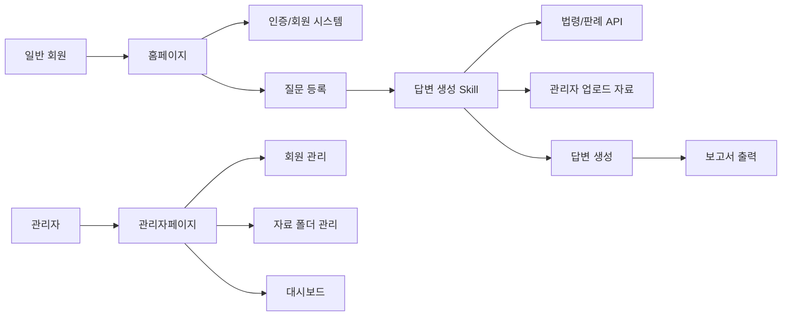
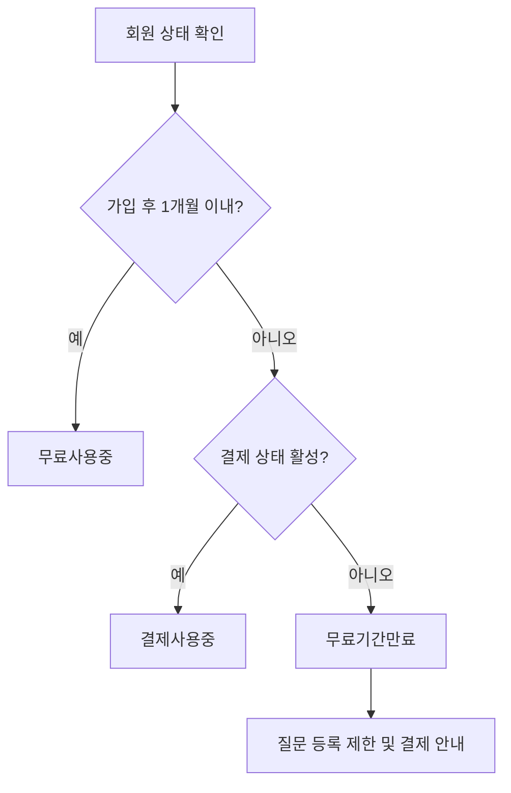

# 세무행정 질의응답 웹 서비스 기획서

## 1. 서비스 개요

### 1.1 서비스 목적

본 서비스는 세무공무원이 행정업무 수행 중 발생하는 법령, 판례, 조례, 내부 지침, 업로드 자료 기반의 질의에 대해 신속하고 일관된 답변을 받을 수 있도록 지원하는 웹 기반 질의응답 서비스이다.

사용자는 홈페이지에서 질문을 입력하고 답변을 확인하며, 관리자는 회원, 자료 폴더, 질의 및 회신 이력, 세목별 이용 현황을 관리한다.

### 1.2 주요 사용자

| 구분 | 설명 |
|---|---|
| 일반 회원 | 세무행정 관련 질문을 등록하고 답변 및 보고서를 확인하는 사용자 |
| 관리자 | 회원, 자료, 질문/답변 이력, 세목별 대시보드, 이용권 상태를 관리하는 사용자 |
| 시스템 | 무료 이용 기간, 결제 필요 여부, 자료 조회 범위, 답변 생성 절차를 자동 처리하는 구성 요소 |

### 1.3 서비스 범위

| 영역 | 주요 기능 |
|---|---|
| 홈페이지 | 회원가입, 로그인, 질문 입력, 답변 확인, 보고서 출력 |
| 관리자페이지 | 회원관리, MD 파일 업로드 및 폴더 관리, 질문/회신 분류, 세목별 대시보드 |
| 답변 엔진 | 질문 분석, 법령 API 조회, 판례 확인, 조례 검토, 업로드 자료 조회, 해석 의견 생성 |
| 이용권 관리 | 1개월 무료 이용, 무료기간 만료 체크, 결제 필요 상태 전환, 향후 결제 연동 고려 |

## 2. 서비스 구조

### 2.1 전체 구성



### 2.2 핵심 원칙

1. 답변은 관리자가 허용한 폴더트리 내 자료만 기반으로 조회한다.
2. 질문과 답변은 회원별, 세목별, 날짜별로 추적 가능해야 한다.
3. 질문 입력과 답변 출력은 긴 텍스트, 표, 복사 붙여넣기, 보고서 변환을 지원해야 한다.
4. 답변 방식은 별도 Skill 형태로 정의하여 지속적으로 개선 가능해야 한다.
5. 현재는 무료 운영을 우선하되, 향후 결제 전환이 가능하도록 이용권 상태와 만료일을 설계에 포함한다.

## 3. 홈페이지 기획

### 3.1 회원가입

#### 기능 설명

사용자는 회원가입 시 기본 정보와 담당 세목을 선택해야 한다.

#### 입력 항목

| 항목 | 필수 | 설명 |
|---|---:|---|
| 이름 | Y | 실명 또는 업무상 표시명 |
| 이메일 | Y | 로그인 ID 및 알림 수신용 |
| 비밀번호 | Y | 보안 정책 적용 |
| 소속 기관 | Y | 지방자치단체, 세무서, 부서 등 |
| 담당 세목 | Y | 법인세, 부가세, 조사, 징세, 재산세, 개인세 중 1개 이상 선택 |
| 연락처 | N | 향후 고객지원 또는 결제 안내용 |
| 약관 동의 | Y | 개인정보 및 서비스 이용약관 |

#### 세목 선택값

| 코드 | 표시명 |
|---|---|
| corporate_tax | 법인세 |
| vat | 부가세 |
| audit | 조사 |
| collection | 징세 |
| property_tax | 재산세 |
| individual_tax | 개인세 |

#### 가입 후 이용 상태

| 상태 | 설명 |
|---|---|
| 무료사용중 | 가입일로부터 1개월 이내 |
| 무료기간만료 | 1개월 경과 후 결제 필요 |
| 결제사용중 | 향후 결제 기능 연동 후 활성화 |
| 이용정지 | 관리자에 의해 제한된 상태 |

### 3.2 로그인

#### 기능 설명

이메일과 비밀번호로 로그인한다. 로그인 후 사용자의 이용 상태를 자동 확인한다.

#### 로그인 처리 조건

| 조건 | 처리 |
|---|---|
| 무료기간 내 | 질문 기능 이용 가능 |
| 무료기간 만료 및 미결제 | 질문 등록 제한, 결제 안내 화면 표시 |
| 관리자 정지 | 로그인 가능 여부 또는 질문 기능 제한 |
| 비밀번호 오류 | 오류 안내 및 재설정 링크 제공 |

### 3.3 질문 입력

#### 기능 설명

사용자는 행정업무 관련 질문을 긴 텍스트 또는 표가 포함된 형식으로 입력할 수 있어야 한다.

#### 입력 포맷 요구사항

| 요구사항 | 설명 |
|---|---|
| 긴 텍스트 입력 | 수천 자 이상의 질문 입력 가능 |
| 표 복사 붙여넣기 | 한글, 엑셀, 웹페이지 표를 붙여넣어 구조 유지 |
| 서식 유지 | 줄바꿈, 목록, 표, 강조, 인용 등을 최대한 유지 |
| 첨부 지원 | 향후 문서, 이미지, PDF 첨부 확장 고려 |
| 임시저장 | 긴 질문 작성 중 유실 방지 |

#### 권장 입력 컴포넌트

일반 textarea가 아니라 리치 텍스트 에디터 또는 마크다운/WYSIWYG 혼합 에디터를 사용한다.

후보:

| 방식 | 장점 | 고려사항 |
|---|---|---|
| ProseMirror/Tiptap 계열 | 표, 붙여넣기, 확장성 우수 | 구현 난이도 중간 이상 |
| Toast UI Editor | 마크다운과 WYSIWYG 지원 | 표 UX 확인 필요 |
| CKEditor | 업무용 문서 편집 기능 강함 | 라이선스 확인 필요 |

### 3.4 답변 확인

#### 기능 설명

질문 등록 후 시스템은 답변 생성 Skill을 실행하고, 사용자는 답변 내용을 확인한다.

#### 답변 화면 구성

| 영역 | 내용 |
|---|---|
| 질문 원문 | 사용자가 입력한 질문 내용 |
| 핵심 쟁점 | 시스템이 분석한 질의 요지 |
| 관련 법령/판례 | 법령 API 및 유사 판례 조회 결과 |
| 조례/지침 검토 | 판례 기반 조례, 지침, 내부 자료 확인 내용 |
| 업로드 자료 근거 | 관리자가 업로드한 책/MD 자료에서 조회한 근거 |
| 최종 의견 | 판례 기반 해석 가능성 및 업무상 판단 의견 |
| 유의사항 | 최종 판단은 담당자 검토 필요 문구 |

#### 복사 지원

답변 영역은 텍스트와 표를 선택하여 복사할 수 있어야 한다. 보고서 작성에 바로 활용할 수 있도록 표 형태 결과는 HTML table 또는 Markdown table 구조를 유지한다.

### 3.5 보고서 출력

#### 기능 설명

질문과 답변 내용을 기반으로 보고서를 출력한다.

#### 보고서 구성

| 순서 | 항목 |
|---:|---|
| 1 | 제목 |
| 2 | 작성자 및 소속 |
| 3 | 작성일 |
| 4 | 질의 요지 |
| 5 | 사실관계 |
| 6 | 관련 법령 |
| 7 | 관련 판례 및 조례 |
| 8 | 검토 의견 |
| 9 | 결론 |
| 10 | 참고자료 |

#### 출력 형식

| 형식 | 우선순위 | 설명 |
|---|---:|---|
| PDF | 1 | 공식 보고서 제출 및 보관 |
| DOCX | 2 | 수정 가능한 보고서 |
| HTML 인쇄 | 3 | 브라우저 즉시 출력 |

## 4. 답변 생성 Skill 기획

답변 생성 방식은 서비스의 핵심 품질을 결정하므로 별도 Skill 형태로 관리한다. 이 Skill은 향후 법령 API, 판례 검색, 내부 자료 검색, 답변 템플릿, 검토 기준을 계속 업데이트할 수 있어야 한다.

### 4.1 Skill 이름

`tax-admin-answer-skill`

### 4.2 Skill 목적

세무행정 질의를 분석하고, 법령/판례/조례/관리자 업로드 자료를 근거로 하여 실무자가 검토 가능한 답변 초안을 생성한다.

### 4.3 입력값

| 입력 | 설명 |
|---|---|
| user_id | 질문자 ID |
| tax_category | 회원 세목 또는 질문 세목 |
| question_content | 질문 원문 |
| allowed_folder_ids | 관리자가 설정한 조회 가능 폴더 |
| uploaded_sources | 폴더 내 MD 파일, 책 요약, 색인 데이터 |
| law_api_config | 법령 및 판례 API 설정 |

### 4.4 처리 단계

#### 1단계. 내용 분석

질문 원문에서 다음 요소를 추출한다.

| 추출 항목 | 설명 |
|---|---|
| 질의 요지 | 질문자가 실제로 묻는 핵심 쟁점 |
| 사실관계 | 사건, 금액, 기간, 행위, 대상자 등 |
| 세목 | 법인세, 부가세, 조사, 징세, 재산세, 개인세 |
| 판단 필요사항 | 과세 여부, 감면 여부, 절차 적정성, 해석 가능성 등 |
| 추가 확인사항 | 답변에 필요한 미확인 정보 |

#### 2단계. 법령 API를 통한 유사 판례 확인

법령 API 또는 판례 API를 통해 질문과 유사한 판례, 결정례, 해석례를 조회한다.

검색 기준:

| 기준 | 설명 |
|---|---|
| 키워드 | 질문에서 추출한 핵심 용어 |
| 세목 | 회원 또는 질문의 세목 |
| 쟁점 유형 | 과세, 감면, 절차, 부과, 징수 등 |
| 최신성 | 최신 판례 및 해석례 우선 |
| 유사도 | 사실관계 및 법적 쟁점 유사도 |

#### 3단계. 판례 기반 조례 등 확인

판례 또는 해석례에서 확인된 법적 쟁점을 기준으로 관련 조례, 시행규칙, 지침, 내부 기준을 확인한다.

확인 대상:

| 대상 | 설명 |
|---|---|
| 조례 | 지방세, 재산세 등 지자체 조례 |
| 시행규칙 | 세목별 세부 집행 기준 |
| 고시/예규 | 행정처리 기준 |
| 내부 지침 | 관리자가 업로드한 업무 기준 |

#### 4단계. 업로드된 책/자료 기반 조회

관리자페이지에서 업로드한 폴더트리 내 MD 파일과 책 자료만 조회한다.

조회 원칙:

1. 사용자의 세목과 권한에 맞는 폴더만 조회한다.
2. 관리자가 허용하지 않은 자료는 답변 근거로 사용하지 않는다.
3. 자료명, 경로, 문단 또는 페이지 단위를 근거로 남긴다.
4. 서로 다른 자료의 내용이 충돌하면 충돌 사실을 명시한다.

#### 5단계. 판례 기반 해석 의견 답변

최종 답변은 단정적 처분 결론이 아니라, 판례와 자료를 근거로 한 검토 의견 형태로 작성한다.

답변 원칙:

| 원칙 | 설명 |
|---|---|
| 근거 중심 | 법령, 판례, 조례, 업로드 자료를 구분하여 제시 |
| 실무형 문장 | 보고서에 바로 활용 가능한 문장으로 작성 |
| 불확실성 표시 | 사실관계 미확인 또는 해석 다툼 가능성 명시 |
| 금지사항 | 근거 없는 단정, 허용 폴더 외 자료 참조, 출처 누락 |

### 4.5 답변 템플릿

```markdown
## 1. 질의 요지

질문 내용의 핵심 쟁점은 다음과 같습니다.

## 2. 사실관계 정리

확인된 사실관계는 다음과 같습니다.

## 3. 관련 법령 및 판례

| 구분 | 명칭 | 주요 내용 | 관련성 |
|---|---|---|---|
| 법령 |  |  |  |
| 판례 |  |  |  |

## 4. 조례 및 내부자료 검토

| 자료명 | 위치 | 주요 내용 | 검토 의견 |
|---|---|---|---|
|  |  |  |  |

## 5. 종합 검토 의견

판례와 관련 자료를 종합하면 다음과 같이 검토할 수 있습니다.

## 6. 결론

해당 사안은 다음과 같이 판단할 여지가 있습니다.

## 7. 추가 확인 필요사항

정확한 판단을 위해 다음 사항을 추가 확인하는 것이 필요합니다.
```

## 5. 관리자페이지 기획

### 5.1 회원관리

#### 기능 설명

관리자는 가입 회원의 상태, 세목, 무료 이용 기간, 결제 여부, 질문 이력을 관리한다.

#### 회원관리 목록

| 항목 | 설명 |
|---|---|
| 회원명 | 이름 |
| 이메일 | 로그인 ID |
| 소속 | 기관 또는 부서 |
| 세목 | 가입 시 선택한 세목 |
| 가입일 | 최초 가입일 |
| 무료 만료일 | 가입일 + 1개월 |
| 이용 상태 | 무료사용중, 무료기간만료, 결제사용중, 이용정지 |
| 질문 수 | 누적 질문 건수 |
| 최근 접속일 | 마지막 로그인 일시 |

#### 관리자 기능

| 기능 | 설명 |
|---|---|
| 회원 검색 | 이름, 이메일, 소속, 세목 기준 |
| 상태 변경 | 이용정지, 정상화, 무료기간 연장 |
| 세목 수정 | 회원 담당 세목 변경 |
| 질문 이력 보기 | 회원별 질문 및 답변 조회 |
| 결제 상태 관리 | 향후 수동/자동 결제 상태 반영 |

### 5.2 폴더구조의 MD 파일 업로드

#### 기능 설명

관리자는 세목별, 업무별 폴더 구조를 만들고 MD 파일을 업로드한다. 답변 생성 Skill은 이 폴더트리 내 자료를 근거로 사용한다.

#### 폴더 구조 예시

```text
/자료
  /법인세
    /기본업무
    /판례정리
    /내부지침
  /부가세
    /신고
    /환급
    /판례정리
  /조사
    /조사절차
    /사례
  /징세
    /체납처분
    /압류
  /재산세
    /과세대상
    /감면
  /개인세
    /종합소득
    /양도
```

#### 업로드 기능

| 기능 | 설명 |
|---|---|
| 폴더 생성 | 세목/업무 단위 폴더 생성 |
| MD 파일 업로드 | Markdown 문서 업로드 |
| 폴더 권한 설정 | 세목 또는 회원 그룹별 조회 가능 범위 설정 |
| 색인 생성 | 업로드 후 검색용 인덱스 자동 생성 |
| 버전 관리 | 파일 수정 이력 보관 |
| 비활성화 | 답변 근거에서 제외 |

### 5.3 회원별 질문 및 회신 내용 분류

#### 기능 설명

관리자는 회원별 질문과 답변 이력을 조회하고, 세목/쟁점/처리상태별로 분류한다.

#### 분류 기준

| 기준 | 설명 |
|---|---|
| 회원 | 질문자 기준 |
| 세목 | 법인세, 부가세, 조사, 징세, 재산세, 개인세 |
| 쟁점 | 과세, 감면, 징수, 절차, 불복, 해석 등 |
| 상태 | 답변완료, 검토필요, 오류신고, 재답변완료 |
| 기간 | 일/주/월/분기별 |

#### 관리자 검토 기능

| 기능 | 설명 |
|---|---|
| 답변 품질 확인 | 생성 답변의 근거와 내용 검토 |
| 재답변 요청 | 답변 품질이 낮을 때 재생성 |
| 오류 표시 | 잘못된 근거 또는 해석 가능성 표시 |
| 내부 메모 | 관리자만 볼 수 있는 메모 작성 |
| 우수 답변 저장 | 향후 학습 또는 템플릿 개선에 활용 |

### 5.4 회원가입 세목별 대시보드

#### 기능 설명

세목별 가입자, 질문량, 이용 상태, 자료 활용도, 무료기간 만료 예정자를 시각화한다.

#### 주요 지표

| 지표 | 설명 |
|---|---|
| 전체 회원 수 | 누적 가입자 |
| 세목별 회원 수 | 법인세/부가세/조사/징세/재산세/개인세별 회원 수 |
| 세목별 질문 수 | 세목별 질의 등록 건수 |
| 답변 완료율 | 질문 대비 답변 완료 비율 |
| 평균 답변 시간 | 질문 등록부터 답변 생성까지 소요 시간 |
| 무료기간 만료 예정자 | 7일 이내 만료 예정 회원 |
| 무료기간 만료자 | 결제 필요 상태 회원 |
| 자료 조회 빈도 | 답변에 자주 활용된 MD 파일 |

## 6. 무료 이용 및 결제 전환 고려

현재는 무료 운영을 우선하지만, 회원별 무료기간과 결제 필요 상태를 처음부터 데이터 구조에 포함한다.

### 6.1 무료 이용 정책

| 항목 | 정책 |
|---|---|
| 무료기간 | 가입일로부터 1개월 |
| 무료기간 중 | 질문, 답변, 보고서 출력 가능 |
| 무료기간 만료 후 | 질문 등록 제한, 기존 이력 조회는 허용 가능 |
| 관리자 예외 | 특정 회원 무료기간 연장 가능 |

### 6.2 자동 체크 로직

로그인, 질문 등록, 매일 정기 작업 시 회원 이용 상태를 확인한다.



### 6.3 향후 결제 화면

향후 유료화 시 다음 화면이 필요하다.

| 화면 | 설명 |
|---|---|
| 요금제 안내 | 월 구독 또는 기관 단위 요금제 |
| 결제 등록 | 카드, 계좌이체 등 |
| 결제 내역 | 회원 또는 기관별 결제 기록 |
| 만료/갱신 안내 | 만료 예정 알림 |
| 관리자 결제 관리 | 결제상태 수동 변경 및 환불 관리 |

### 6.4 무료 운영 단계에서 필요한 화면

| 화면 | 설명 |
|---|---|
| 무료기간 안내 | 가입 후 1개월 무료 안내 |
| 만료 예정 알림 | 무료기간 종료 전 안내 |
| 만료 상태 화면 | 현재는 결제 준비 중이라는 안내 |
| 관리자 분석 화면 | 만료자, 활성 사용자, 세목별 전환 가능성 분석 |

## 7. 데이터 구조 초안

### 7.1 users

| 필드 | 설명 |
|---|---|
| id | 회원 ID |
| name | 이름 |
| email | 이메일 |
| password_hash | 비밀번호 해시 |
| organization | 소속 |
| tax_category | 담당 세목 |
| status | 이용 상태 |
| joined_at | 가입일 |
| trial_started_at | 무료 시작일 |
| trial_ends_at | 무료 종료일 |
| paid_until | 결제 만료일 |
| last_login_at | 최근 로그인 |

### 7.2 questions

| 필드 | 설명 |
|---|---|
| id | 질문 ID |
| user_id | 질문자 |
| tax_category | 질문 세목 |
| title | 질문 제목 |
| content_html | 원문 HTML |
| content_markdown | 원문 Markdown |
| status | 처리 상태 |
| created_at | 등록일 |

### 7.3 answers

| 필드 | 설명 |
|---|---|
| id | 답변 ID |
| question_id | 질문 ID |
| answer_html | 답변 HTML |
| answer_markdown | 답변 Markdown |
| summary | 요약 |
| sources | 참조 근거 목록 |
| skill_version | 답변 Skill 버전 |
| created_at | 답변 생성일 |

### 7.4 folders

| 필드 | 설명 |
|---|---|
| id | 폴더 ID |
| parent_id | 상위 폴더 |
| name | 폴더명 |
| tax_category | 세목 |
| is_active | 사용 여부 |
| permission_scope | 접근 권한 |

### 7.5 documents

| 필드 | 설명 |
|---|---|
| id | 문서 ID |
| folder_id | 소속 폴더 |
| file_name | 파일명 |
| content_markdown | MD 내용 |
| version | 버전 |
| indexed_at | 색인 생성일 |
| is_active | 답변 사용 여부 |

### 7.6 subscriptions

| 필드 | 설명 |
|---|---|
| id | 구독 ID |
| user_id | 회원 ID |
| plan_type | 무료, 유료, 기관계정 등 |
| status | 활성, 만료, 취소 |
| started_at | 시작일 |
| ended_at | 종료일 |
| payment_provider | 향후 결제사 |

## 8. 화면 목록

### 8.1 홈페이지

| 화면 | 설명 |
|---|---|
| 회원가입 | 세목 선택 포함 |
| 로그인 | 이메일/비밀번호 로그인 |
| 질문 작성 | 긴 텍스트 및 표 입력 |
| 답변 상세 | 답변, 근거, 복사 기능 |
| 보고서 출력 | PDF/DOCX/인쇄 출력 |
| 내 질문 목록 | 질문 및 답변 이력 |
| 이용 상태 | 무료기간 및 결제 필요 여부 |

### 8.2 관리자페이지

| 화면 | 설명 |
|---|---|
| 관리자 로그인 | 관리자 인증 |
| 회원 목록 | 회원 검색 및 상태 관리 |
| 회원 상세 | 질문 이력, 무료기간, 결제 상태 |
| 자료 폴더 관리 | 폴더 생성 및 MD 업로드 |
| 자료 상세 | 문서 내용, 버전, 색인 상태 |
| 질문/답변 관리 | 질의 분류 및 품질 확인 |
| 세목별 대시보드 | 가입자, 질문 수, 만료자 분석 |
| 이용권 분석 | 무료기간, 결제 전환 가능성 관리 |

## 9. 권한 및 보안

| 항목 | 정책 |
|---|---|
| 개인정보 보호 | 비밀번호 해시, 개인정보 접근 제한 |
| 자료 접근 제한 | 허용 폴더 외 자료 조회 금지 |
| 관리자 권한 | 회원, 자료, 답변 이력 접근 권한 분리 |
| 감사 로그 | 관리자 작업 이력 기록 |
| 질문 보안 | 민감정보 포함 가능성을 고려한 저장 및 접근 통제 |
| 출처 관리 | 답변에 사용된 근거 자료를 추적 가능하게 저장 |

## 10. 개발 우선순위

### 10.1 1차 MVP

1. 회원가입 및 로그인
2. 세목 선택
3. 1개월 무료 이용 상태 관리
4. 질문 작성 화면
5. 관리자 MD 파일 업로드 및 폴더 관리
6. 허용 폴더 기반 답변 생성 기본 구조
7. 답변 상세 및 복사 기능
8. 관리자 회원/질문 목록

### 10.2 2차 개발

1. 법령/판례 API 연동
2. 답변 Skill 고도화
3. 보고서 PDF/DOCX 출력
4. 질문/답변 분류 자동화
5. 세목별 대시보드
6. 자료 색인 및 검색 품질 개선

### 10.3 3차 개발

1. 결제 시스템 연동
2. 기관 단위 계정 관리
3. 답변 품질 평가 및 개선 루프
4. 관리자 권한 세분화
5. 알림 기능
6. 통계 리포트 자동 생성

## 11. 향후 검토 필요사항

| 항목 | 검토 내용 |
|---|---|
| 법령 API | 사용 가능한 공식 API, 호출 제한, 인증 방식 |
| 판례 데이터 | 판례/결정례/해석례 데이터 범위 |
| 조례 데이터 | 지자체별 조례 조회 방식 |
| 자료 저작권 | 업로드 책, 문서의 사용 권한 |
| 답변 책임 범위 | 법적 판단 보조 도구로서의 고지 문구 |
| 결제 정책 | 개인 결제, 기관 결제, 무료 회원 유지 범위 |
| 보안 수준 | 공공 업무 자료 처리에 필요한 보안 요건 |

